   **概述**

-   漏洞编号：CVE-2025-13780
    
-   影响软件：pgAdmin 4（< 9.10 安全版本前）
    
-   漏洞类型：命令注入 / 远程代码执行
    
-   风险等级：高危
    
-   复现环境：腾讯云轻量应用服务器（OpenCloudOS）+ Docker + VulHub 靶场
    
-   复现日期：2026-05-15
    
-   报告作者：[zebra39] 

- 漏洞原理：pgAdmin 4 在通过 `psql` 执行用户上传的恢复文件时，未能过滤 `\!` 元命令。攻击者可在 SQL 文件中嵌入 `\!` 指令，借助 `psql` 的执行权限在服务器上运行任意系统命令，导致远程代码执行
   
   - **1.云服务器环境搭建准备**
 
     -   1.1**安装 Docker 环境**：VulHub 靶场需要 Docker 运行

     -   1.2**启动 Docker 服务并配置开机自启**：
     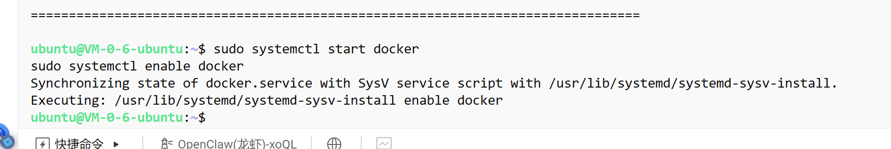
     -   1.3**验证 Docker 是否安装成功**：验证compose命令也能执行
  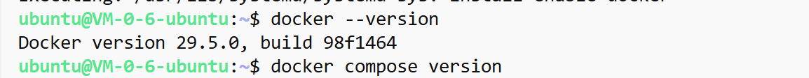
        -   1.4**开放安全组窗口**：这是云服务器特有的关键一步，不要遗漏，这才能用自己电脑的浏览器，打开靶场网页。
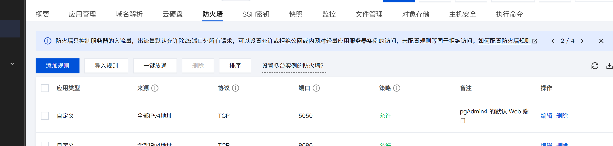

   - **2.漏洞靶场搭建**
     -  2.1**下载 VulHub 项目**
     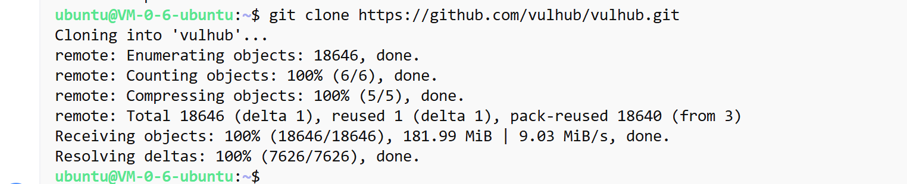
       -  2.2**进入 CVE-2025-13780 靶场目录**
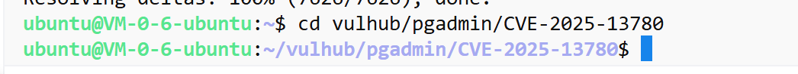
     -  2.3**启动漏洞环境**：使用 Docker Compose 一键启动，-d 参数代表在后台运行
     - 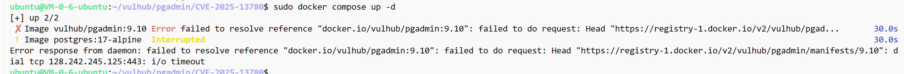
     - 这里经常超时的话可以 配置腾讯云 Docker 镜像加速来解决
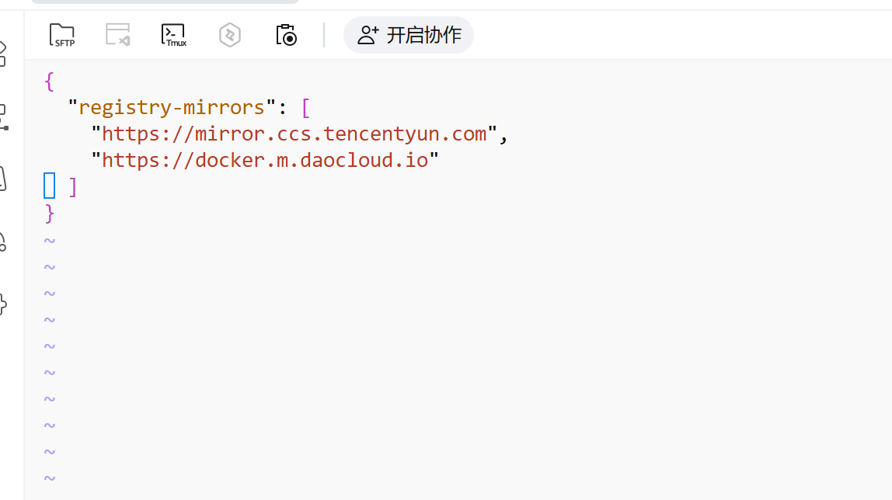
     - 进入vi编辑模式按一个**i**下面会显示一个insert，这时候就可以插入数据了，如果打错了按空格space之后再按backspace就可以删除
     - 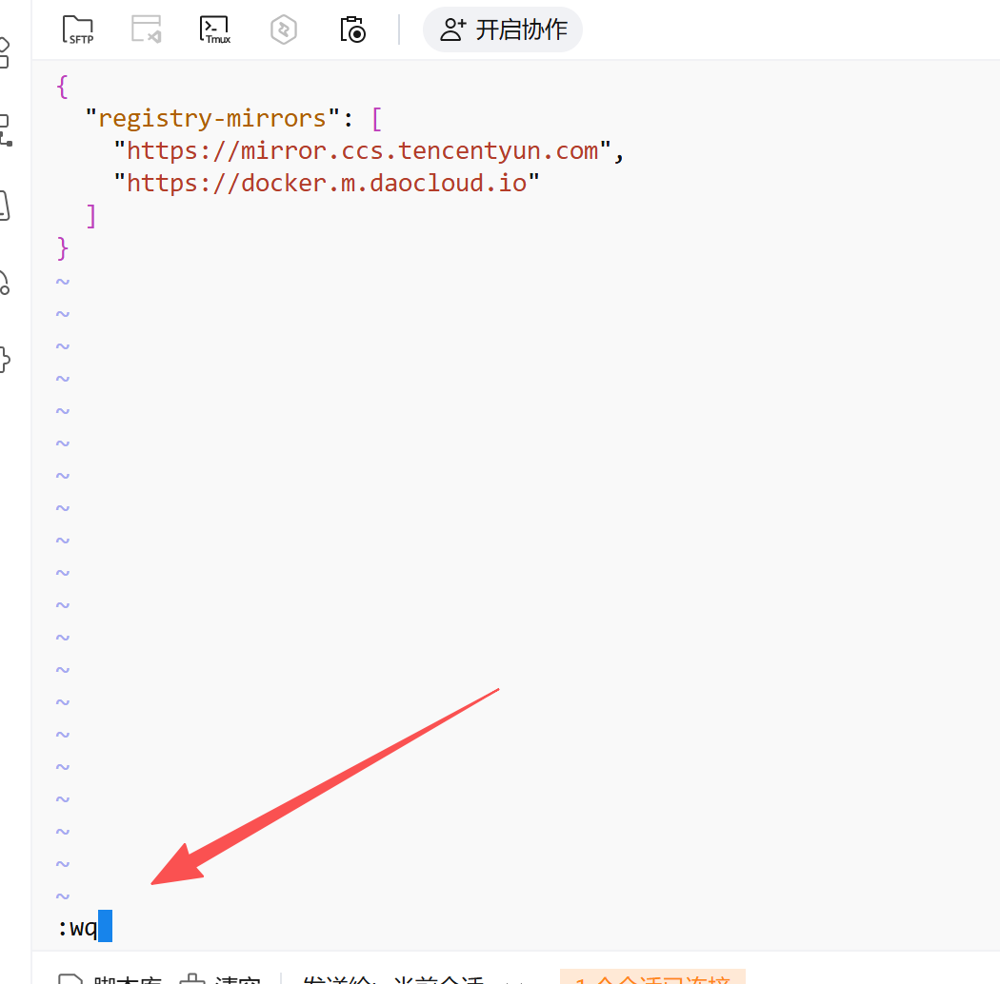
     按ESC建之后就退出编辑模式，然后输入**: **（注意是英文的）在最底下会出现，再输入wq就可以退出编辑且保存
     重启 Docker 服务使配置生效和重新拉取镜像并启动靶场，成功启动靶场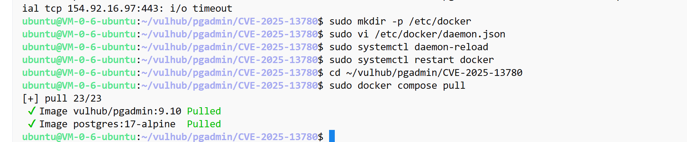
     启动成功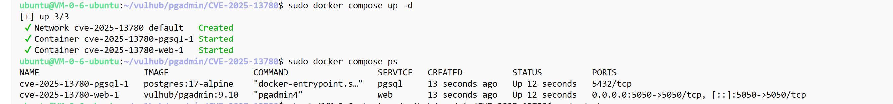

        成功访问web界面：

  -  **3.漏洞利用实战过程**
     -   **3.1构造payload**：在服务器上创建一个 `payload.sql` 文件，写入以下内容。原理是利用 `\!` 元命令绕过检查，在服务器上执行系统命令
`echo -ne "SELECT 1;\r\\! id > /tmp/vuln_test.txt\r" > /tmp/payload.sql`
     -   **`\r`**：回车符，用来“欺骗”过滤规则，因为很多过滤机制只检查明文换行（`\n`），而 `\r` 可以另起一行又绕过匹配。
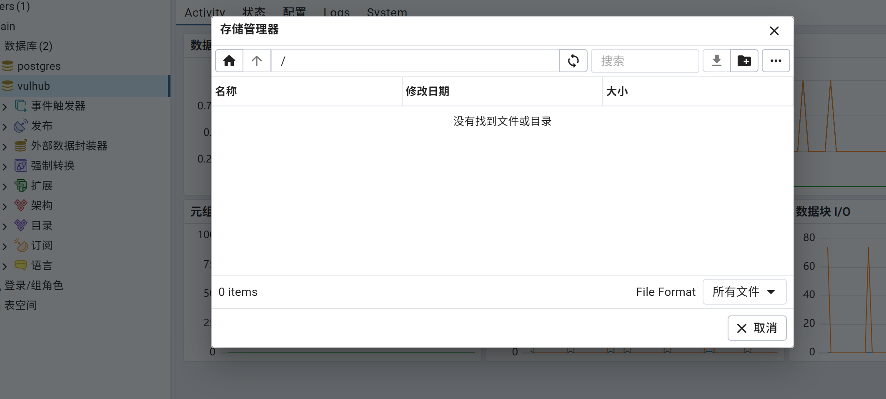
这里发现输入了该命令之后没有看到服务器里面我们的payload.sql文件，点上传文件只能现在本地的文件上传，这里可以利用scp协议，也就是在自己的电脑运行一条命令，**通过加密通道**把文件从服务器上“拿下来”或“传上去”，输入自己服务器登入密码即可

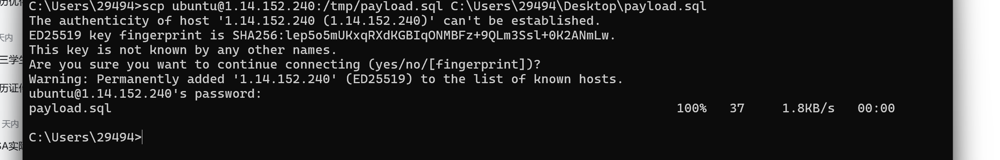
最终成功上传如下
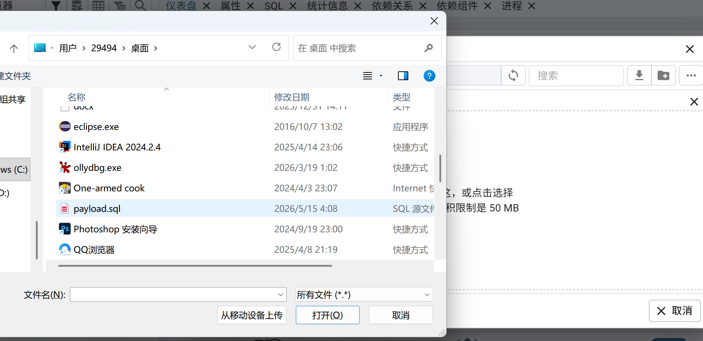

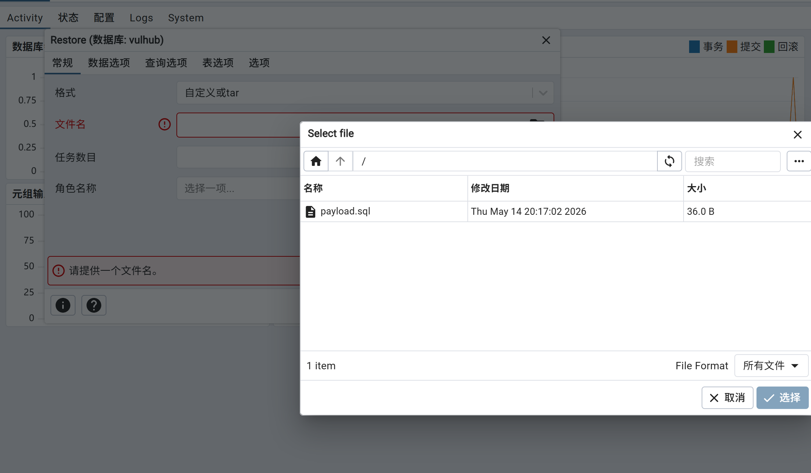
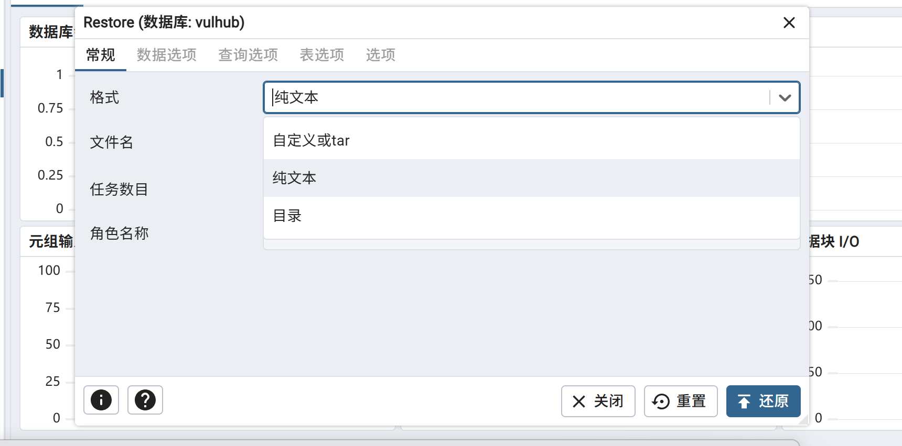
选择纯文本上传（plain）之后显示恢复完成：
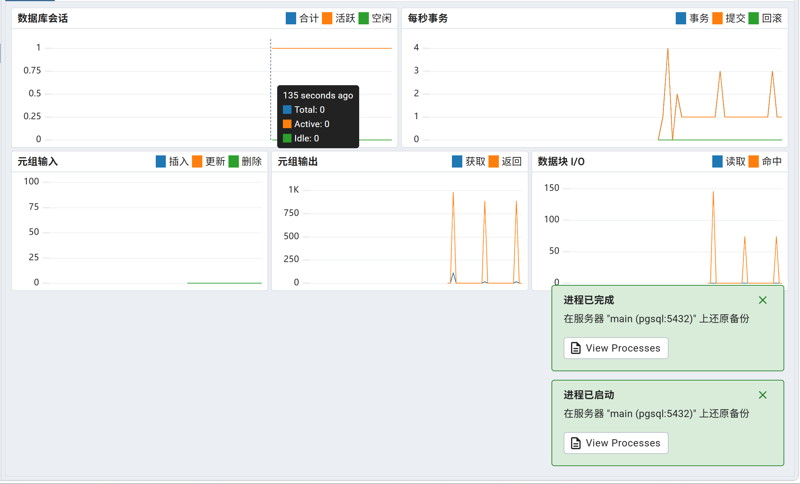

**验证**：在服务器执行 `docker compose exec web cat /tmp/vuln_test.txt`，成功输出 `uid=1(daemon) gid=1(daemon) groups=1(daemon)`，确认 `id` 命令已在 pgAdmin 容器内以 `daemon` 用户身份执行，远程代码执行漏洞复现成功
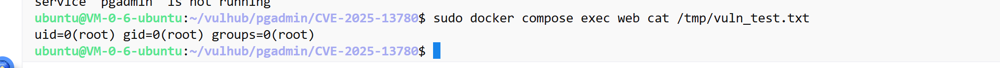

## 4. 漏洞修复建议

-   **升级版本**：将 pgAdmin 4 升级到已修复该漏洞的版本
    
-   **输入过滤**：在服务端对用户上传的 SQL 文件内容进行严格检查，过滤 `\!` 等危险元命令
    
-   **权限最小化**：运行 pgAdmin 服务的容器应使用低权限用户，限制可执行命令的范围
    
-   **网络隔离**：pgAdmin 管理界面不应暴露于公网，应使用 VPN 或 IP 白名单访问
## 5. 思考总结

-   本次复现展示了“功能滥用”型命令注入的典型利用方式
    
-   开发人员往往只关注 SQL 语句本身的安全，忽略了数据库工具（如 psql）提供的元命令也可能被滥用
    
-   通过该实验，进一步掌握了 Docker 环境下的漏洞复现流程、SCP 文件传输、`docker compose` 容器管理等技能
    
-   后续可将类似的攻击思路扩展到其他数据库管理工具的审计中
